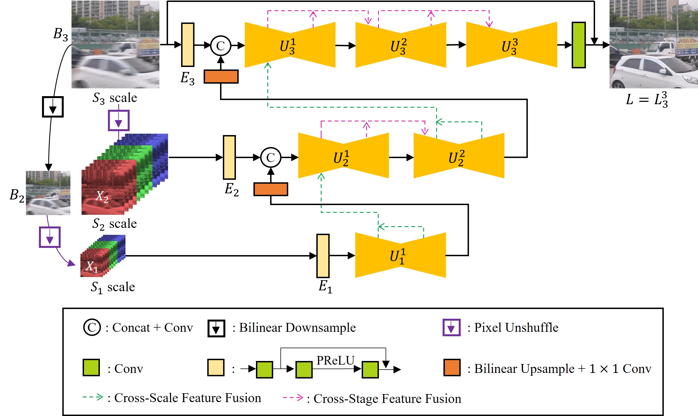
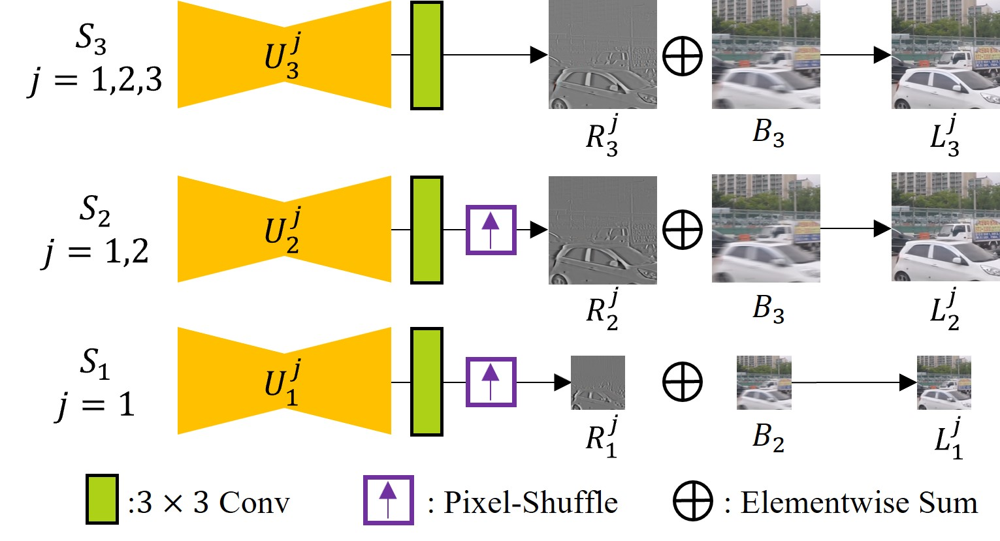

# Multi-Scale-Stage Network for Single Image Deblurring
### [Project](http://cg.postech.ac.kr/Research/MSSNet/) | [Paper](http://cg.postech.ac.kr/Research/MSSNet/MSSNet.pdf) | [Supple](http://cg.postech.ac.kr/Research/MSSNet/MSSNet_supp.pdf)
  
### Official Implementation of ECCVW Paper
> MSSNet: Multi-Scale-Stage Network for Single Image Deblurring  
> Kiyeon Kim, Seungyong Lee, Sunghyun Cho  
> POSTECH  
> ECCV 2022 Workshop (AIM 2022)
  
### Architecture
#### Network Architecture
  
  
#### Training of MSSNet

  
## Installation
```shell
git clone https://github.com/kky7/MSSNet.git
```

To install warmup scheduler, refer [MPRNet](https://github.com/swz30/MPRNet)
```shell
cd pytorch-gradual-warmup-lr; python setup.py install; cd ..
```

## Dependencies
- Python
- Pytorch 1.4 or 1.7
- scikit-image
- Tensorboard
  
## Download
  
### Dataset
`Train`  [[GOPRO_Large](https://seungjunnah.github.io/Datasets/gopro.html)]

`Test`  [[Google Drive](https://drive.google.com/file/d/12hV5HFTYT1CsYdbOtCr3Sw7xo1DopSeq/view?usp=sharing)] 
  
### Pre-trained models [[Google Drive](https://drive.google.com/file/d/1w8eFYRhevHDiz2TAJUcO9h9P5qbSrCQL/view?usp=sharing)]
  
## Training
if you use one gpu or multiple gpu using data parallel, run  
```shell
sh sh_train_mssnet.sh
```

if you use multiple gpu using distributed data parallel, run  
```shell
sh sh_train_mssnet_ddp.sh
```
  
### Arguments
- train_datalist : Text file with the path of image for training
- val_datalist : Text file with the path of image for validation
- checkdir : Path to save checkpoints
- loadchdir : Path of checkpoint to load
- data_root_dir : Root path of data in train_datalist
- val_root_dir : Root path of data in val_datalist
- isloadch : Whether to load checkpoint
- isval : Whether to use validation
- mgpu : Whether to use multiple gpu
- wf, scale, vscale : Hyper-Parameters for channel size
  
    | Model| wf | scale | vscale |
    |-------|----|----|----|
    |MSSNet_small | 20 | 40 | 40 |
    |MSSNet | 54 | 42 | 42 |
    |MSSNet_large| 80 | 50 | 50 |

  

## Testing
Run
```shell
sh sh_test_mssnet.sh
```
  
### Arguments
- test_datalist : Text file with the path of image for testing
- data_root_dir : Root path of data in test_datalist
- load_dir : Path of checkpoint to load
- outdir : Path to save test results
- is_save : Whether to save test results
- is_eval : Whether to evaluate the model on the GoPro test dataset using psnr of skimage.metrics
  
## Evaluation
Run `evaluate_gopro.m` file to evaluate model on the gopro dataset.  
This code is based on the [MPRNet](https://github.com/swz30/MPRNet/tree/main/Deblurring).
  
## Acknowledgment
The code is based on the [MPRNet](https://github.com/swz30/MPRNet/tree/main/Deblurring), [MIMO-UNet](https://github.com/chosj95/MIMO-UNet) and [ddp_example](https://gist.github.com/sgraaf/5b0caa3a320f28c27c12b5efeb35aa4c).
  
## Citation
```bibtex
@inproceedings{Kim2022MSSNet,
author = {Kim, Kiyeon and Lee, Seungyong and Cho, Sunghyun},
title = {MSSNet: Multi-Scale-Stage Network for Single Image Deblurring},
booktitle = {Proc. of ECCVW (AIM)},
year = {2022}
}
```
